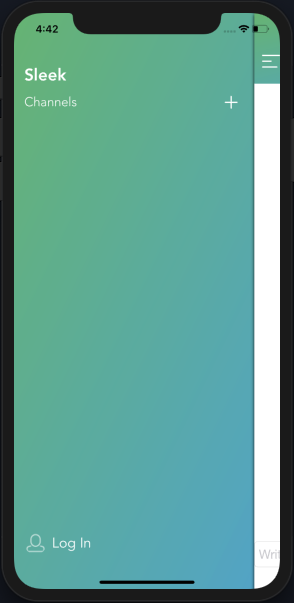
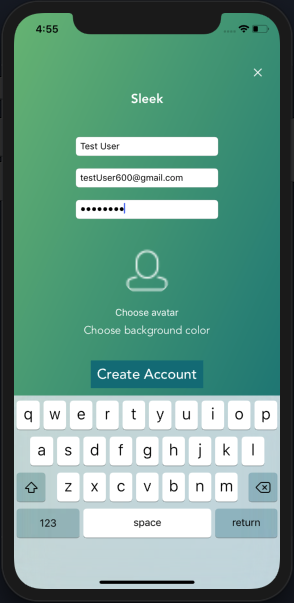
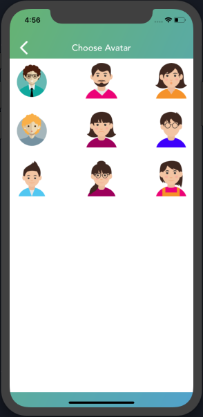
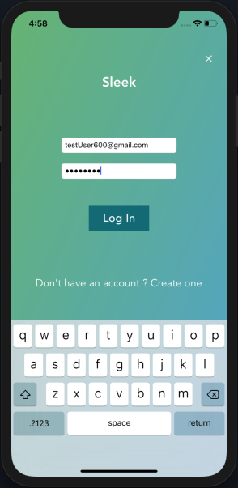

# Sleek

An iOS Clone for Slack built using modified (self) pre-built [mac-chat-api](https://github.com/PradhumnaPancholi/mac-chat-api) by Devslopes.

## Pods Used

    1. Alamofire
    2. SwiftyJSON
    3. SocketIO

## Key functionalities:-

    1. User can Sign in, Log In, and Log Out.
    2. Data persistance to keep user logged in until he/she logs out.
    3. User will be automatically able to to see existing channels.
    4. User can create new channel (if logged in).
    5. Implementation of sockets so user can see messages and channels as soon as created.
    6. User can send messages to each other on any channel (if logged in).

# Screens

    1. Slider (Built using SWReveal)

    2. User Account

    SignUp Account Form | User SignUp Avatar Selection | SignUp Accouunt Form filled 
 |  | 
